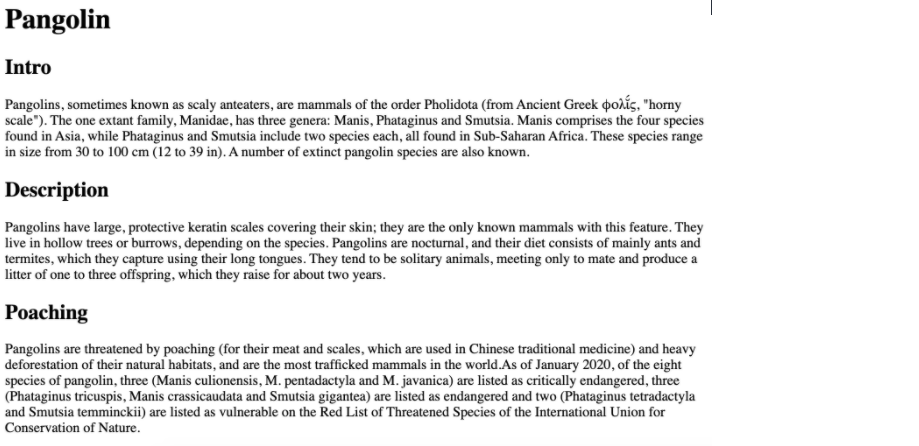
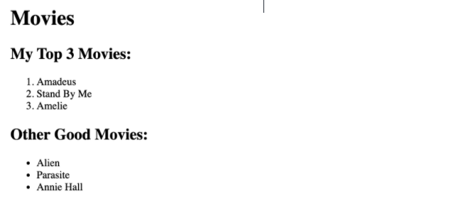
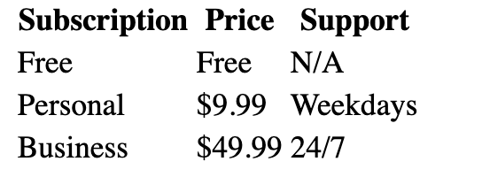

## HTML

- Type of challenge: **exercise solo**
- Duration: **2h30**

---

1. **_Pangolin exercise_**
   Let's get a little bit of practice with heading and paragraph elements. Copy the html-exercises-assets/pangolin.txt content into an html file. Please add in the appropriate paragraph and heading elements to recreate what is shown in this image:

---

2. **_Favorite Movies Exercises_**
   It's time to practice working with ordered and unordered lists. Copy the html-exercises-movies.txt content into an html file. Please add on to the markup to recreate the two lists in the following image.

   

---

3. **_Wolf Images & Links Exercise_**
   Let's get some practice with HTML Images and Anchor Elements. In a html file, please do the following:

Create an image element using this source: https://upload.wikimedia.org/wikipedia/commons/5/5f/Kolm%C3%A5rden_Wolf.jpg

The image element should be clickable in order to redirect us to https://en.wikipedia.org/wiki/Wolf in a new tab

Make sure to include some alt text on the image!

---

4. **_Snowman Logo Exercise_**
   Write an `<h1>` element to recreate the following image:

There is a snowman entity code. Find it! (you will need to google it)

Use the registered trademark entity code (the circled R at the end) , AND be sure to make it superscript

Note: No one expects you to memorize any of the entity codes. Get used to googling them! It's normal!

---

5.  **_Table Practice Exercise_**
    It's time to get some practice with all those table-related elements! (yikes) Your goal is to create a 3x3 table, with proper headings. (so it's really 4x3 if you count the heading cells) I've provided you with some starter data in html-exercises-tables, though you do not have to use it. Just make sure you create a 3x3 table with a row of headings at the top, using the correct semantic elements. You are expected to use the following elements: table, thead, tr, th, tbody, and td

Here is what the table would look like with the starter data provided :

---

6. **_Forms Practice Exercise_**
   Let's get some practice with forms, inputs, labels, and buttons! Write a simple form with the following inputs:

   1. Username

      a. Text Input

      b. Should have placeholder text of 'username'

      c. Make sure to properly label the input (using id/for attributes)

   2. Password

      a. Password Input

      b. Should have placeholder text of 'password'

      c. Make sure to properly label the input (using id/for attributes)

   3. A Button
      a. With the inner text 'Register'

I added in some `
` elements for spacing, but you don't need to:

---

7. Just for practice, inspect a website on Chrome and play around changing tags, meta title, content of the texts, etc. Get to know the inspector !

---
<!-- 

<!DOCTYPE html>
<html lang="en">

<head>
    <meta charset="UTF-8">
    <meta name="viewport" content="width=device-width, initial-scale=1.0">
    <link rel="stylesheet" href="./style.css">
    <title>Document</title>
</head>

<body>

    <title> Pangolin</title>
    <h1>Pangolin</h1>
    <h2>Intro</h2>

    Pangolins, sometimes known as scaly anteaters, are mammals of the order Pholidota (from Ancient Greek φολῐ́ς, "horny
    scale"). The one extant family, Manidae, has three genera: Manis, Phataginus and Smutsia. Manis comprises the four
    species found in Asia, while Phataginus and Smutsia include two species each, all found in Sub-Saharan Africa. These
    species range in size from 30 to 100 cm (12 to 39 in). A number of extinct pangolin species are also known.

    <h2> Description</h2>

    Pangolins have large, protective keratin scales covering their skin; they are the only known mammals with this
    feature. They live in hollow trees or burrows, depending on the species. Pangolins are nocturnal, and their diet
    consists of mainly ants and termites, which they capture using their long tongues. They tend to be solitary animals,
    meeting only to mate and produce a litter of one to three offspring, which they raise for about two years.

    <h2> Poaching</h2>

    Pangolins are threatened by poaching (for their meat and scales, which are used in Chinese traditional medicine) and
    heavy deforestation of their natural habitats, and are the most trafficked mammals in the world.As of January 2020,
    of the eight species of pangolin, three (Manis culionensis, M. pentadactyla and M. javanica) are listed as
    critically endangered, three (Phataginus tricuspis, Manis crassicaudata and Smutsia gigantea) are listed as
    endangered and two (Phataginus tetradactyla and Smutsia temminckii) are listed as vulnerable on the Red List of
    Threatened Species of the International Union for Conservation of Nature.

    <h1>2 Favorite Movies Exercises</h1>

    <h1>Movies</h1>
    <h2>My Top 3 Movies:</h2>

    <ol type="1">
        <li> Amadeus</li>
        <li> Stand By Me</li>
        <li> Amelie</li>
    </ol>

    <h2>Other Good Movies:</h2>

    <ul>
        <li>
            Alien</li>
        <li>Parasite</li>
        <li>Annie Hall</li>
    </ul>

    <h2>Wolf Images & Links Exercise</h2>

    

    

    <h2>Snowman Logo Exercise</h2>

    <h1>&#x2603;<b>snowman Productions</b> &#174;</h1>

    <h2>Table Practice Exercise</h2>

    <table>
        <tr>
            <th>
                <h2>subscription</h2>
            </th>
            <th>
                <h2>price</h2>
            </th>
            <th>
                <H2>support</H2>
            </th>
        </tr>
        <tr>
            <td>Free</td>
            <td>Free</td>
            <td>N/A</td>
        </tr>
        <tr>
            <td>Personal</td>
            <td>$9.99</td>
            <td>Weekdays</td>
        </tr>
        <tr>
            <td>Business</td>
            <td>$49.99</td>
            <td>24/7</td>
        </tr>
    </table>

    <h1>Forms Practice Exercise</h1>

    <form action="/action_page.php">
        <label for="fname">Username: </label><input  type="text" id="fname" name="fname" placeholder="username"> 
        <label for="lname">Password: </label>
        <input type="text" id="lname" name="password" placeholder="password"> 
        <input type="submit" value="register">
    </form>
</body>

</html> -->
